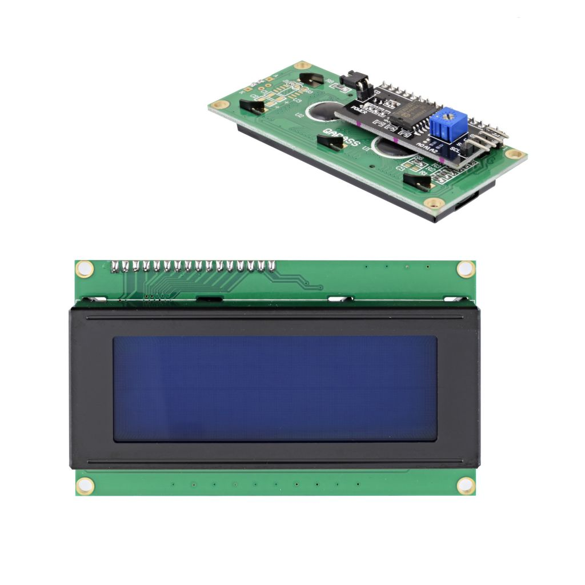
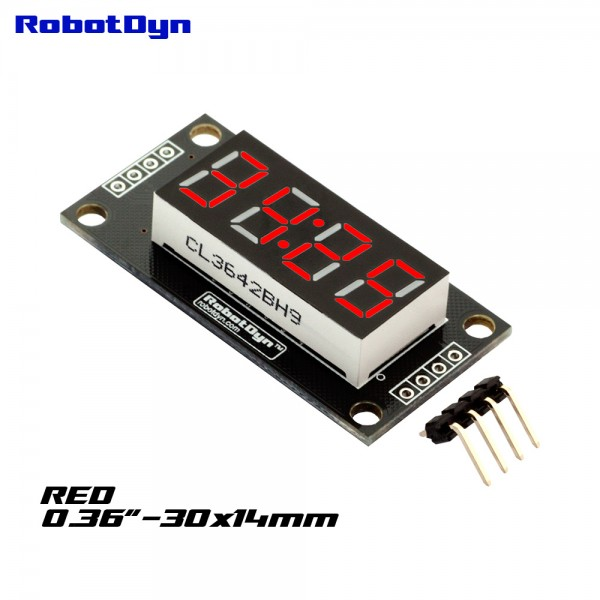
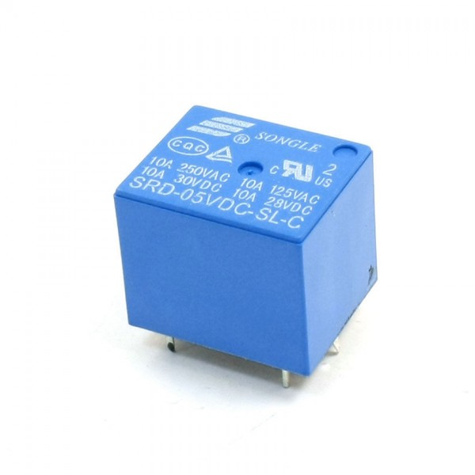
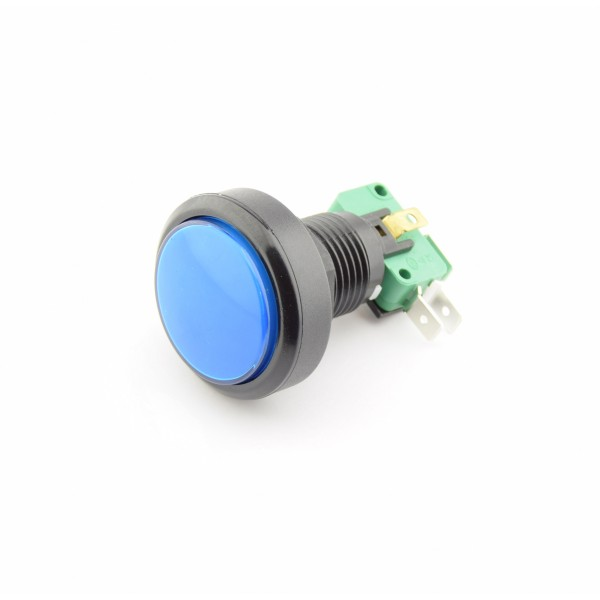
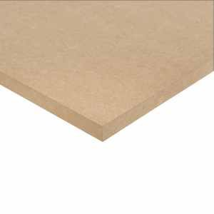

## **Puzzelbox componenten:**

---

| Component|  Prijs | Aantal| Betaald? |Afbeelding|
|:----: |:----: |:----:|:----: |:----: |

|20x4 LCD display met I2C backpack  | [9 euro](https://www.tinytronics.nl/shop/nl/displays/lcd/lcd-display-20*4-karakters-met-witte-tekst-en-blauwe-backlight-met-i2c-backpack)|1| Ter beschikking op campus |  |
|Deur Solenoïde 12V 1A| [10 euro](https://www.tinytronics.nl/shop/nl/mechanica-en-actuatoren/elektromagneten/solenoids/deur-solenoid-12v-1a-jf-s1040dl) |1 | Ter beschikking op campus|  |
|3x4 keypad| [3,75 euro](https://www.tinytronics.nl/shop/nl/schakelaars/manuele-schakelaars/keypads/keypad-3x4-matrix-membraan) | 1 | Bestelling tinytronics |  |
|Clock Display Module - 4 karakters - klok - rood- TM1637| [3,50 euro](https://www.tinytronics.nl/shop/nl/displays/segmenten/robotdyn-segmenten-display-module-4-karakters-klok-rood-tm1637-mini) | 1 | Bestelling tinytronics |  |
|Relais 5V- 250VAC -10A | [1,00 euro](https://www.tinytronics.nl/shop/nl/schakelaars/relais/relais-5v-250vac-10a) |2| Bestelling tinytronics|  |
| Grote Blauwe Drukknop 24mm of 40mm - Reset | [3,50 euro](https://www.tinytronics.nl/shop/nl/schakelaars/manuele-schakelaars/drukknoppen-en-schakelaars/grote-blauwe-drukknop-24mm-of-40mm-reset) |1| Bestelling tinytronics|  |
| Grote Groene Drukknop 24mm of 40mm - Reset | [3,50 euro](https://www.tinytronics.nl/shop/nl/schakelaars/manuele-schakelaars/drukknoppen-en-schakelaars/grote-groene-drukknop-24mm-of-40mm-reset) |1| Bestelling tinytronics|  |
| 30x60 MDF plaat 6mm dik| 2,10 euro |2| Ter berschikking op campus|  |
| Espressif ESP32-WROOM-32D Draadloze module | [6,60 euro](https://www.conrad.be/nl/p/espressif-esp32-wroom-32d-draadloze-module-1-stuk-s-1925467.html?t=1&utm_source=kelkoo&utm_medium=vergelijkers&utm_term=1925467&utm_campaign=feed) |1| Ter beschikking op campus|  |
| ||| **TOTAAL**| 46.05 euro |

---

## **UV-slot componenten:**

---

| Component| Prijs | Aantal | Betaald? |Afbeelding|
|:----: |:----: |:----:|:----: |:----: |
|16x2 LCD display met I2C backpack | [7 euro](https://www.tinytronics.nl/shop/nl/displays/lcd/lcd-display-16*2-karakters-met-witte-tekst-en-blauwe-backlight-met-i2c-backpack) |1| Bestelling tinytronics| |
|3x4 keypad| [3,75 euro](https://www.tinytronics.nl/shop/nl/schakelaars/manuele-schakelaars/keypads/keypad-3x4-matrix-membraan) |1| Bestelling tinytronics|  |
|Relais 5V- 250VAC -10A | [1,00 euro](https://www.tinytronics.nl/shop/nl/schakelaars/relais/relais-5v-250vac-10a) |1| Bestelling tinytronics|  |
| 30x60 MDF plaat 6mm dik| 2,10 euro |1| Ter berschikking op campus|  |
| Espressif ESP32-WROOM-32D Draadloze module | [6,60 euro](https://www.conrad.be/nl/p/espressif-esp32-wroom-32d-draadloze-module-1-stuk-s-1925467.html?t=1&utm_source=kelkoo&utm_medium=vergelijkers&utm_term=1925467&utm_campaign=feed) |1| Ter beschikking op campus|  |
| ||| **TOTAAL**| 20.45 euro |

**Opmerking:**

Kabels, connectoren, leds en smd componenten zoals NPN transistors, weerstanden, condensators,... waren ter beschikking op campus dus zijn niet inbegrepen in de prijs.

De blacklight is besteld geweest door het team van TrappenMaar en zit niet in deze kostenanalyse.

Men kan opmerken, dat het 7segment clock display, de solenoïde, de keypads, de twee lcd's en de drukknoppen. Allemaal makkelijk af te breken zijn en geen verloren geld is. Met dit in gedachte te houden zit ik onder de beschikbaar gestelde 50 euro.

---