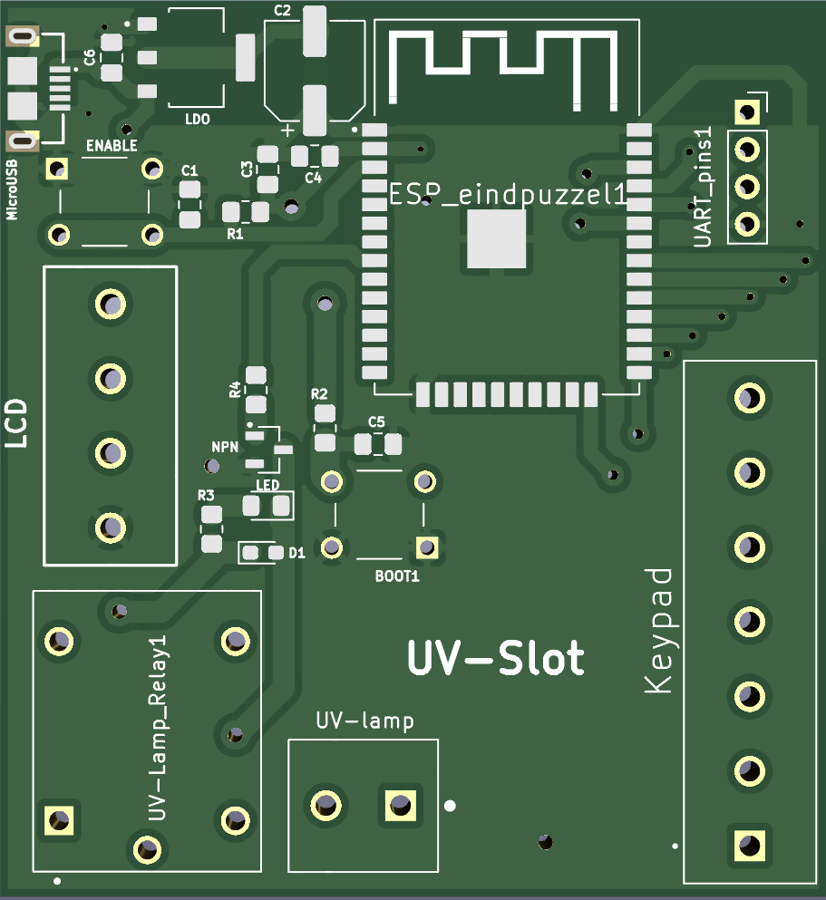
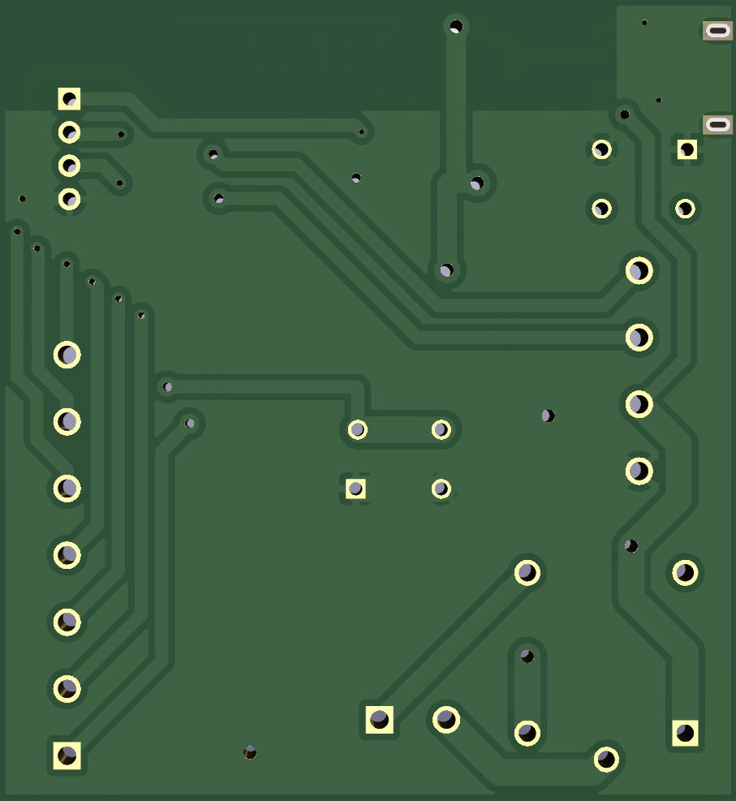
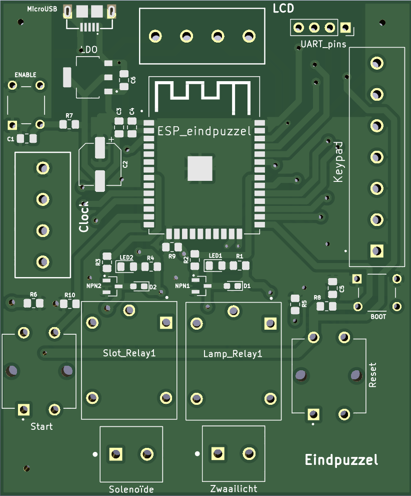
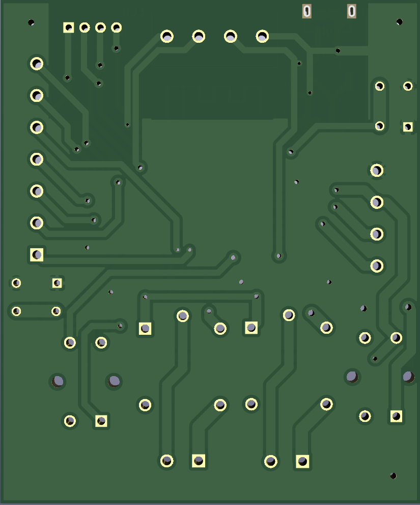

# De hardware

We zullen dit opsplitsen in twee delen omdat er 2 pcb's zijn gerealiseerd.

---

## UV-slot pcb

---

Het heeft de bassis enable knop, boot knop en UART bridge setup. 
Als voeding hebben we een powerbank gekozen die via een micro usb connector verbinding maakt met onze pcb. De powerbank is gekozen omdat we zowel 5V als 3.3V nodig hadden. De 5V is nodig voor de relais en lcd display te voeden en 3.3V is nodig voor de esp. We hebben de 5V omgezet naar een 3.3V via een LDO.

Deze pcb zal ook een cijferslot met keypad en lcd realiseren. Dit bestaat uit een lcd display en een 4x3 keypad.
Dit cijferslot zal via de esp wroom 32 een relais sturen.

Als pin connectoren hebben we suikertjes gebruikt, dit vonden we het gemakkelijkst en het betrouwbaarst.

### Het schema van de pcb

[Klik hier voor het svg bestand van deze schakeling.](https://raw.githubusercontent.com/PLAN-IT-B/BachelorProefCommunicatieEnEinde/main/Documentatie%20UV-slot/Schakeling_UV-Lock/Schakeling_UV-Lock.svg)

### 3D view van pcb

|Voorkant | Achterkant |
|:----: |:----: |
|||
| [PCB-voorkant in het groot](https://github.com/PLAN-IT-B/BachelorProefCommunicatieEnEinde/blob/main/Documentatie%20UV-slot/Schakeling_UV-Lock/pcb2-voorkant.png)| [PCB-achterkant in het groot](https://github.com/PLAN-IT-B/BachelorProefCommunicatieEnEinde/blob/main/Documentatie%20UV-slot/Schakeling_UV-Lock/pcb2-achterkant.png)|

---

Klik [hier](https://github.com/PLAN-IT-B/BachelorProefCommunicatieEnEinde/tree/main/Documentatie%20UV-slot/Schakeling_UV-Lock) voor de KiCad files van het UV-slot.

---

## Eindpuzzel pcb

---

Dit bordje bestuurt via een esp wroom 32 twee relais die 5V nodig hebben. Samen met een 5V lcd en een 4x3 keypad.
De 5V komt toe op het bordje door een powerbank en via een micro usb connector. Een LDO vormt deze om naar 3.3V zodat ook de eps gevoed kan worden.

Zoals u links boven op de schakeling ziet is dit ook het bordje waar de start- en resetknop op aangesloten is voor de functionaliteit van de volledige escaperoom. Dit is nog niet alles, als de kers op de taart is er ook een 7 segment clock dispaly geschakeld.

**Opmerking:** De start- en resetknop die zijn aangesloten op het finale design zijn een volledig ander model dan deze op het pcb design. Dit komt omdat we speciale druknoppen met ingebouwde led voorziening hebben besteld in het begin. Maar deze knoppen zijn niet bij de eerste bestelling toegekomen. Hierdoor dachten we niet dat we deze nog ging krijgen, en hebben we deze niet geintegreerd in het pcb design. Echter zijn deze knoppen wel toegekomen bij de tweede bestelling, die een week later is toegekomen dan de pcb bestelling verstuurd is geweest. Omdat we deze licht functionaliteit zo leuk vonden. Hebben we besloten deze te gebruiken en hebben we handmatig extra pinnen en condensators (voor betere debouncing) aan de pcb moeten solderen. 

### Het schema van de pcb

[Klik hier voor het svg bestand van deze schakeling.](https://raw.githubusercontent.com/PLAN-IT-B/BachelorProefCommunicatieEnEinde/main/Documentatie%20eindpuzzel/Schakeling/Schakeling.svg)

### 3D view van pcb

|Voorkant | Achterkant |
|:----: |:----: |
|||
| [PCB-voorkant in het groot](https://github.com/PLAN-IT-B/BachelorProefCommunicatieEnEinde/blob/main/Documentatie%20eindpuzzel/Schakeling/pcb1-voorkant.png)| [PCB-achterkant in het groot](https://github.com/PLAN-IT-B/BachelorProefCommunicatieEnEinde/blob/main/Documentatie%20eindpuzzel/Schakeling/pcb1-achterkant.png)|

---

Klik [hier](https://github.com/PLAN-IT-B/BachelorProefCommunicatieEnEinde/tree/main/Documentatie%20eindpuzzel/Schakeling)  voor alle KiCad files van de eindpuzzel.

---

## Solenoïde

Voor een slot te realiseren heb ik gebruik gemaakt van een solenoïde. Deze solenoïde vraagt meer spanning en trekt meer stroom dan gewenst op een pcb. Omdat het zoveel stroom trekt zou het niet lukken om het in de pcb te integreren. We hebben kegozen voor een aparte lipo batterij in serie met een relais over de solenoïde te schakelen. Door de relais heeft de esp toch controlle over de solenoïde.

**Opmerking:** Eerst was het de bedoeling deze solenoïde op een echte deur te bevestigen. Op een gegeven moment bleek dat we een deftig lokaal kregen en mocht dit niet bevestigd worden. Daardoor heb ik de solenoïde in een doos moeten steken. Pas wanneer de solenoïde dicht bij de pcb staat. Kregen we problemen met de wet van Faraday doordat de solenoïde een grote stroom trek dus een magnetisch veld creëerde die invloed heeft op het pcb. Een oplossing hiervoor was het beperken van de ruis op de pcb door grote condensators te gebruiken. 

Op een gegeven moment bleek het dat we de connectie verliezen met de mqqt broker, na de stroom los te laten over de solenoïde. Hierdoor konden we geen berichten sturen op dat gegeven moment. De berichten die we wouden sturen waren van essentieel belang voor de werking van de andere puzzels. Dus hebben we gebruik gemaakt van een boolean in de reconnect functie van de esp, die op een creatieve manier ervoor zorgt dat toch de juiste communicatie afgehandeld wordt.

---