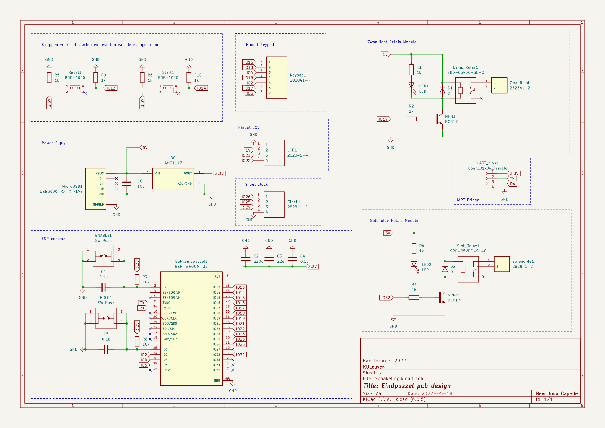

# De hardware

We zullen dit opsplitsen in twee delen omdat er 2 pcb's zijn gerealiseerd.

## Eindpuzzel pcb

[Klik hier voor het svg bestand.](https://raw.githubusercontent.com/PLAN-IT-B/BachelorProefCommunicatieEnEinde/main/Documentatie%20eindpuzzel/Schakeling/Schakeling.svg)

## UV-slot pcb

[Klik hier voor het svg bestand.](https://raw.githubusercontent.com/PLAN-IT-B/BachelorProefCommunicatieEnEinde/main/Documentatie%20UV-slot/Schakeling_UV-Lock/Schakeling_UV-Lock.svg)